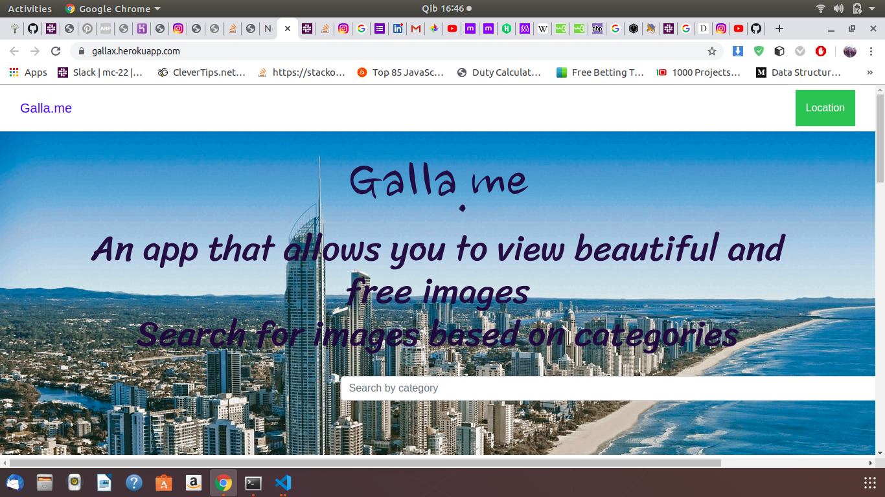
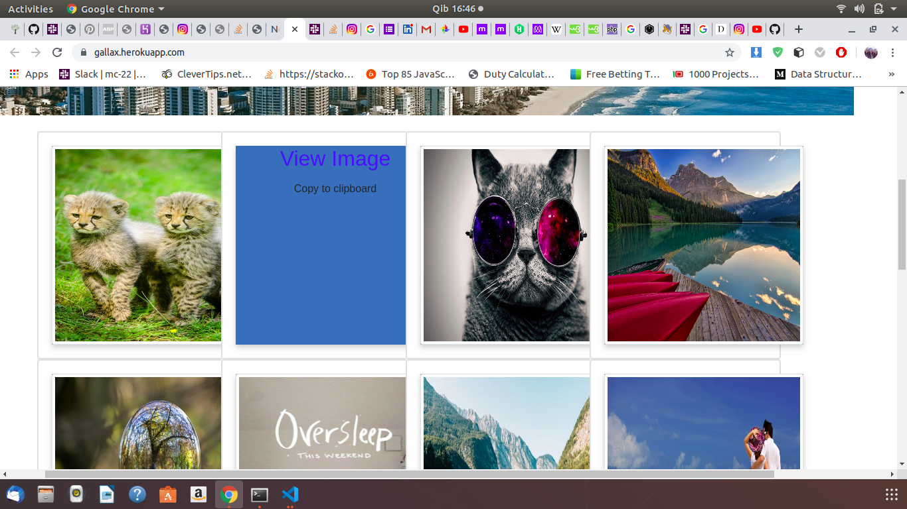

### GALLERY
An application build using Django a python framework.This application allows user to view images based on different locations,categories and also the description of the given image.  

### Author name
AUDREY MITCHEL MACHARIA

### Project Description
Gallery  is an app build with python3.6,its an app that allows you to view images based on different locations, categories and also the description of the image.

### Application setup instructions:
INstall Django3.2 and python3.6

Git clone repo then you will need to install venv that is a virtual enviroment and run source virtual/bin/activate

Then pip freeze > requirements.txt

To run the application, in your terminal:
$ python3 manage.py runserver

Testing the Application
tests on class files

$ python3 manage.py test

Technologies Used
This project was generated using

1.Python version 3.8.0. 2.Django 3.Bootstrap 4.javascript 5.PSQL database 6.HTML,CSS